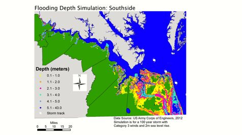
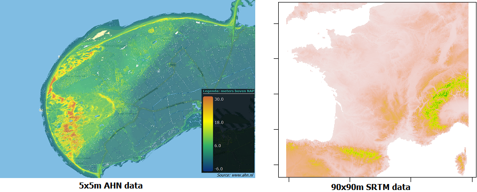
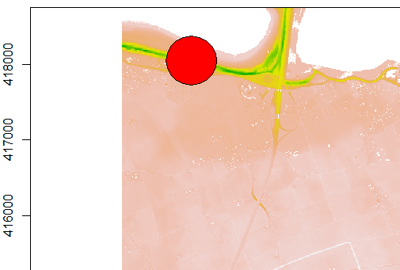
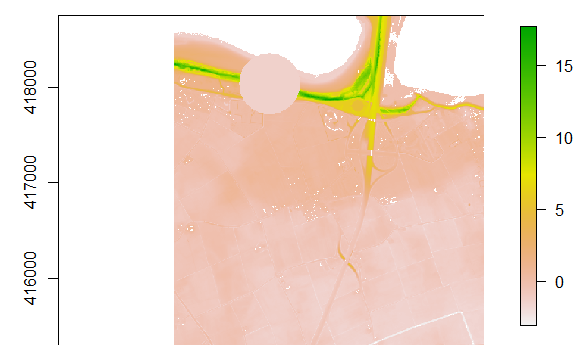
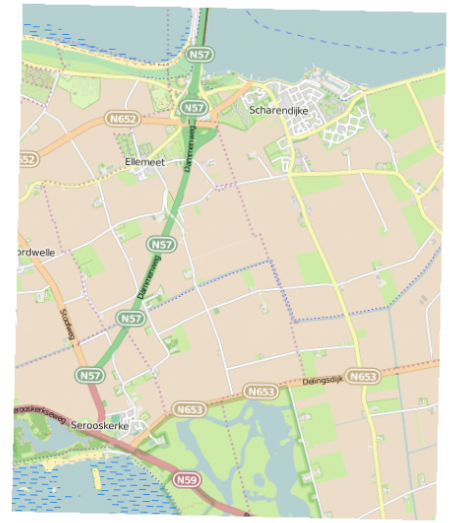
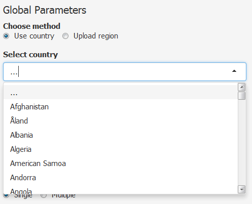

# Introduction

Project: 
Simulate the flooding a dyke breach would cause

Content based on main.R:

- Input Data
- Used functions
- Shiny
- Output

# Input Data

- Base of all scripts is a Digital Elevation Map[DEM]
- Algemene Hoogtebestand Nederland
- Raster package::getData('alt', countrycode)

  
# Used functions

### Calculate breach area

- Input breach coordinates and width
- Create buffer around coordinates 
- If multiple breaches loop through breaches and create buffer for each breach
- Output one or multiple SpatialPolygons

# Used functions

### Create a DEM with breache(s)

- Input DEM and breach.area
- Extract minimum value for each unique SpatialPolygon
- Rasterize the polygons
- Merge polygons with DEM
- Output DEM with adjusted height for breach areas

# Used functions

### Calculate flooded area

- Input breach.area, water.height & DEM.withbreach
- Fill up the DEM with adjusted height. All values lower than the water height are removed and all other cells receive the value (waterheight-height)
- Group all adjacent rastercells with the same waterdepth value
- Select groups that are located in the breach area's and set cellvalue to waterdepth

# Used functions

### Create basemap

- Input flooded area
- Re-project the extent of the flooded area to the coordinate system of OpenStreetMap
- Download OpenStreetMap data that is within the extent
- Re-project data to coordinate system of flooded area
- Output basemap

# Shiny

###UserInterface

- Interactive input variables

###Server

- Create output from these variables

But, it's not as easy as it sounds:
circa **300** lines of code!

# Output

## Achievements

- Script is working globally
- Multiple breaches are possible
- Total flooded area and distribution of waterdepth in a histogram
- Accessible by everyone, everywhere

## Example Netherlands

[Go to application](https://wilmarvanommeren.shinyapps.io/floodrisk/)

# Wat we geleerd hebben