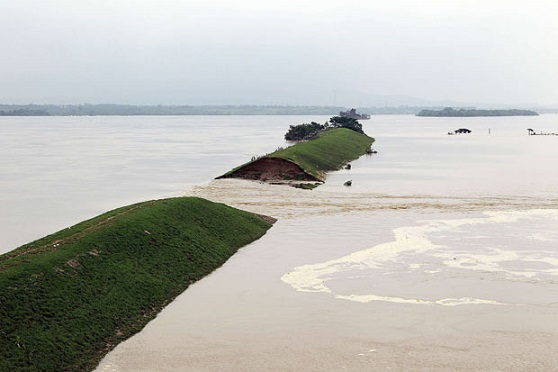

# Introduction

**Simulate flood by dyke breach**

Content of presentation:

- Input Data
- Used functions
- Shiny
- Output

# Input Data

Base of all scripts is a Digital Elevation Map[DEM]   

- Algemene Hoogtebestand Nederland
- raster::getData('alt', countrycode)

  
# Used functions

### Calculate breach area

- Create buffer around input coordinates 
- Turned into a SpatialPolygon
- Multiple buffers can be made

# Used functions

### Create a DEM with breach(es)

- Extract minimum value of DEM under SpatialPolygon
- Rasterize polygons and merge with DEM

# Used functions

### Simulate flooded area

- Fill the new DEM by removing all cells that are higher then the waterheight
- Remaining cells: Waterheight - Elevation
- Only select cells that are adjacent to breach area

# Used functions

### Create basemap
- Re-project the extent of the flooded area(RD) to the coordinate system of OpenStreetMap(wgs84)
- Download OpenStreetMap data that is within the extent
- Re-project data to coordinate system of flooded area

# Shiny

###UserInterface

- Interactive input variables

###Server

- Create output from these variables

But, it's not as easy as it sounds:
circa **300** lines of code!

# Output

## Achievements

- Script is working globally
- Multiple breaches are possible
- Total flooded area and distribution of waterdepth in a histogram
- Accessible by everyone, everywhere

## Example Netherlands

[Go to application](https://wilmarvanommeren.shinyapps.io/floodrisk/)

# Conclusion

## We've learned:

- There is a package for almost everything
- Most of our problems were not new => much was asked and answered before
- Using Git allowed us to work separately
- Not everything is as easy as it looks at first sight

## Questions?

